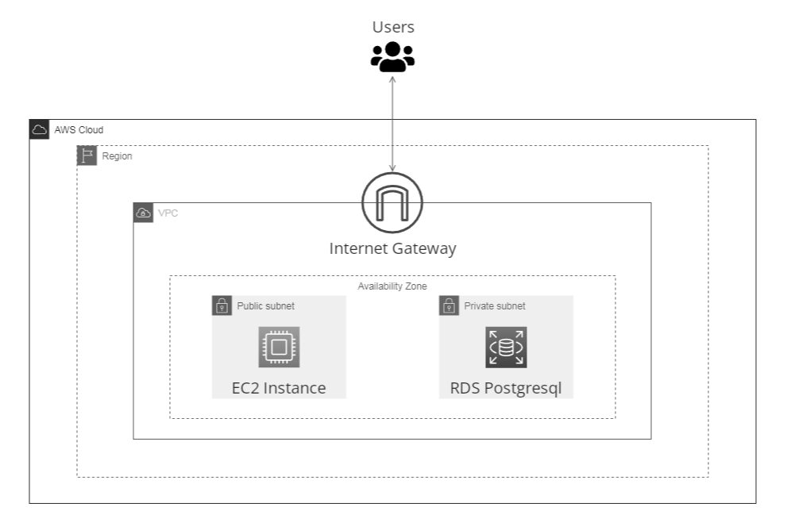

# Wanderlust

Travel inspiration platform that includes a user-friendly website for exploring travel destinations and a RESTful API for accessing travel data programmatically.


## About

Wanderlust is a comprehensive Travel Destination Platform that combines a user-friendly website and a powerful RESTful API. The website offers an interactive user-friendly interface where you can discover travel destinations, view detailed city information, check real-time weather updates, and book flight tickets. Simultaneously, the RESTful API empowers developers to programmatically access data, enabling them to retrieve, create, update, and delete destinations.

## Explore

The project is now hosted on [Render](https://render.com/) after the expiration of the AWS free tier.<br>
Please note that it may take up to 1 minute to start when first accessed, as I am using a free instance on Render. <br>
This is due to the instance spinning down after a period of inactivity. Once it's warmed up, the loading times will be faster.

<a href="https://wanderlust-v4k4.onrender.com/api/docs/">
    </img>
</a>
<br>
<a href="https://wanderlust-v4k4.onrender.com/">
    </img>
</a>
<br><br>

**<ins>QUICK NOTE:</ins> <br>Even tho the passwords are hashed and salted i recommend you to avoid using your personal informations when you sign up.<br>**

*If you don't want to register you can use the following account: Test@yahoo.com - Test1* which is also showcased at the login/register page.<br><br>

~~Hosted by [AWS](https://aws.amazon.com/) using the following architecture:~~
- ~~**EC2**~~
- ~~**RDS PostgreSQL**~~
- ~~**Internet Gateway**~~
<br>


## Features

### Wanderlust Website

- **Random Destination Discovery:** Experience the thrill of spontaneity by exploring random travel destinations.
- **In-Depth City Insights:** Discover cities with comprehensive pages showcasing popular attractions, ratings, and valuable insights.
- **Tailored Travel Planning:** Explore the world's most visited destinations or narrow down your choices by continent for focused travel planning.
- **Real-Time Weather Forecast:** Stay prepared with 7-day weather forecasting for each city on your itinerary.
- **Flight Ticket Booking:** Book your flight tickets with our integrated booking widget.
- **Intuitive User Interface:** Enjoy a user-friendly and elegant interface for effortless navigation and travel inspiration.
- **User Account Features:** Sign up and log in to save places to your "visited" or "plan to visit" lists, making your travel planning more accessible.
- **Interactive Map:** Visualize your travel journey with an interactive map, giving you a geographical overview of your adventures.
- **Achievements Tracker:** Track your travel achievements and earn badges.

### Wanderlust API

- **Effortless Data Retrieval:** Retrieve destination data, including ratings, descriptions, and more.
- **Advanced Search and Filtering:** Advanced search and filtering capabilities to find destinations that match specific criteria.
- **Dynamic Data Updates:** Add new destinations to expand the travel content or update existing details to keep the information fresh.
- **Secure Data Deletion:** Maintain data integrity by securely deleting destinations as needed.
- **Clear Documentation:** Simplify development with clear and comprehensive API documentation using Swagger UI.
- **Error Handling and Validation:** Ensure data integrity and reliability with robust error handling and input validation.
- **API Key Integration:** Sign up to generate a secure and unique API key, allowing you to access the Wanderlust API.

## Technologies

- **Front-End Development:** HTML, CSS, JS, Bootstrap.
- **Back-End Development:** Flask, PostgreSQL + SQLAlchemy.
- **Visualization:** Plotly for interactive choropleth maps, Leaflet for visualizing city maps.
- **API Integration:** VisualCrossing API for weather forecasting, RestCountries API for countries FAQ and Flags, Nominatim API for geocoding, trip.com for flight ticket booking.
- **API Docs:** Swagger UI.
- **Testing:** PyTest.

---
# Wanderlust API

## Authorization

All API requests require the use of a generated API key. You can find your API key, or generate a new one, in your profile tab after registering to Wanderlust.
To authenticate an API request, you should provide your API key in the `Authorization` header (also works if you provide api_key as a parameter).

| Headers | Parameter | Description |
| :--- | :--- | :--- |
| `Authorization` | `api_key` | **Required**. Your Wanderlust API key |


## Request methods

| Method   | Description                                                              |
| -------- | ------------------------------------------------------------------------ |
| `GET`    | Used to retrieve a single item or a collection of items.                 |
| `POST`   | Used when creating new items.         |
| `PATCH`  | Used to update one or more fields on an item. |
| `DELETE` | Used to delete an item.                                                  |

## Endpoints

| Method   | URL                                        | Description                                |  Parameters Required/Additional                     | 
| -------- | ------------------------------------------ | ------------------------------------------ |  ------------------------------------------ |
| `GET`    | `/api/random`                              | Retrieve a random destination.             |  - / -                                                               |
| `Get`    | `/api/all`                                 | Retrieve all destination.                  |  - / -                                                           |
| `GET`    | `/api/recent`                              | Retrieve recent added destinations.        |  - / -                                                           |
| `Get`    | `/api/search`                              | Retrieve searched destinations.            |  - /  `country`, `city`, `description`, `budget`, `eating_out`, `sightseeing`, `activities`, `shopping`, `nightlife`, `museums`, `kid_friendly`, `beaches`, `skiing`, `diving`, `camping`, `hiking`, `cycling`, `sailing`, `romantic`, `photography`, `popular_attractions`, `picture`|
| `POST`   | `/api/add_destination`                     | Add new destination.                       |  `continent` `country` `city` `description` `popular_attractions` / `budget`, `eating_out`, `sightseeing`, `activities`, `shopping`, `nightlife`, `museums`, `kid_friendly`, `beaches`, `skiing`, `diving`, `camping`, `hiking`, `cycling`, `sailing`, `romantic`, `photography`, `picture`|
| `PATCH`  | `/api/update_destination/{destination_id}` | Update destination at #destination_id.     |  `destination_id` / `continent`, `country`, `city`, `description`, `popular_attractions`, `budget`, `eating_out`, `sightseeing`, `activities`, `shopping`, `nightlife`, `museums`, `kid_friendly`, `beaches`, `skiing`, `diving`, `camping`, `hiking`, `cycling`, `sailing`, `romantic`, `photography`, `picture`|
| `DELETE` | `/api/delete_destination/{destination_id}` | Delete destination #destination_id.        |  `destination_id` / -                                               |
| `GET`    | `/api/get_weather`                         | Retrieve 7-day forecast for a city. |  `city` / -                                            |

**Note:** The `DELETE /api/delete_destination/{destination_id}` endpoint can only be accessed by the Admin user. Other users do not have the necessary permission to delete destinations.

## HTTP Response Status Codes

| Code  | Title                     | Description                              |
| ----- | ------------------------- | ---------------------------------------- |
| `200` | `OK`                      | Successful request. |
| `201` | `Created`                 | Successfully created a new resource. |
| `204` | `No Content`              | Successfully processed request with no content to return. |
| `400` | `Bad Request`             | Invalid request or request parameters. |
| `401` | `Unauthorized`            | Unauthorized access. |
| `404` | `Not Found`               | Resource not found. |
| `500` | `Internal Server Error`   | Internal server error. |

## Example

When interacting with the Wanderlust API, the format of the response depends on whether you're requesting a single item or a collection of items. The following example illustrates how the API response is structured in these two scenarios:
<br>
##### A single item:
```
{
  "destination": {
    "id": 4,
    "continent": "Europe",
    "country": "Spain",
    "city": "Barcelona",
    "budget": "moderate",
    "ratings": {
      "eating_out": 5,
      "sightseeing": 5,
      "activities": 5,
      "shopping": 4,
      "nightlife": 5,
      "museums": 5,
      "kid_friendly": 4,
      "beaches": 4,
      "skiing": 0,
      "diving": 3,
      "camping": 2,
      "hiking": 3,
      "cycling": 3,
      "sailing": 4,
      "romantic": 5,
      "photography": 5
    },
    "description": "Discover the passion and beauty of Barcelona",
    "popular_attractions": "Some must-visit attractions in Barcelona include Sagrada Familia, Park Guell, La Rambla, Gothic Quarter, and Casa Batllo.",
    "picture": "https://images.unsplash.com/photo-1583395838144-09c70d270bda?ixlib=rb-4.0.3&ixid=M3wxMjA3fDB8MHxwaG90by1wYWdlfHx8fGVufDB8fHx8fA%3D%3D&auto=format&fit=crop&w=1072&q=80"
  }
}
```
##### A collection of items:
```
{
  "destinations": [
    {
      "id": 103,
      "continent": "Oceania",
      "country": "Vanuatu",
      "city": "Port-Vila",
      "budget": "moderate",
      "ratings": {
        "eating_out": 3,
        "sightseeing": 4,
        "activities": 3,
        "shopping": 2,
        "nightlife": 2,
        "museums": 2,
        "kid_friendly": 3,
        "beaches": 5,
        "skiing": 0,
        "diving": 5,
        "camping": 4,
        "hiking": 4,
        "cycling": 3,
        "sailing": 5,
        "romantic": 4,
        "photography": 4
      },
      "description": "Where adventure meets paradise",
      "popular_attractions": "Some of the must-see attractions in Port-Vila include the Mele Cascades, Hideaway Island, the National Museum of Vanuatu, and the Port-Vila Market.",
      "picture": "https://images.unsplash.com/photo-1552643450-44f3e5c7d875?auto=format&fit=crop&q=80&w=1074&ixlib=rb-4.0.3&ixid=M3wxMjA3fDB8MHxwaG90by1wYWdlfHx8fGVufDB8fHx8fA%3D%3D"
    },
    {
      "id": 102,
      "continent": "Africa",
      "country": "Morocco",
      "city": "Casablanca",
      "budget": "moderate",
      "ratings": {
        "eating_out": 5,
        "sightseeing": 4,
        "activities": 4,
        "shopping": 5,
        "nightlife": 4,
        "museums": 5,
        "kid_friendly": 4,
        "beaches": 4,
        "skiing": 0,
        "diving": 3,
        "camping": 2,
        "hiking": 2,
        "cycling": 3,
        "sailing": 4,
        "romantic": 4,
        "photography": 4
      },
      "description": "The gateway to Morocco's exotic adventures",
      "popular_attractions": "The top attractions to visit in Casablanca include Hassan II Mosque, Old Medina, Corniche, and the Royal Palace.",
      "picture": "https://images.unsplash.com/photo-1538230575309-59dfc388ae36?auto=format&fit=crop&q=80&w=1174&ixlib=rb-4.0.3&ixid=M3wxMjA3fDB8MHxwaG90by1wYWdlfHx8fGVufDB8fHx8fA%3D%3D"
    },
    {
      "id": 101,
      "continent": "Africa",
      "country": "Ethiopia",
      "city": "Lalibela",
      "budget": "affordable",
      "ratings": {
        "eating_out": 3,
        "sightseeing": 5,
        "activities": 3,
        "shopping": 1,
        "nightlife": 2,
        "museums": 3,
        "kid_friendly": 3,
        "beaches": 0,
        "skiing": 0,
        "diving": 0,
        "camping": 4,
        "hiking": 5,
        "cycling": 3,
        "sailing": 0,
        "romantic": 3,
        "photography": 5
      },
      "description": "Discover the ancient wonders of Lalibela",
      "popular_attractions": "Lalibela is famous for its 11 rock-hewn churches that are UNESCO World Heritage Sites.",
      "picture": "https://images.unsplash.com/photo-1572888195250-3037a59d3578?auto=format&fit=crop&q=80&w=1200&ixlib=rb-4.0.3&ixid=M3wxMjA3fDB8MHxwaG90by1wYWdlfHx8fGVufDB8fHx8fA%3D%3D"
    }
  ]
}
```
##### Get weather request output format:
```
{
    '2024-02-14': {'temp': 8, 'description': 'rain'},
    '2024-02-15': {'temp': 6, 'description': 'partly-cloudy-day'},
    '2024-02-16': {'temp': 6, 'description': 'clear-day'},
    '2024-02-17': {'temp': 7, 'description': 'partly-cloudy-day'},
    '2024-02-18': {'temp': 9, 'description': 'partly-cloudy-day'},
    '2024-02-19': {'temp': 7, 'description': 'cloudy'},
    '2024-02-20': {'temp': 4, 'description': 'partly-cloudy-day'}
}
```

---
## Credits

- **Data:** The ratings for cities were gathered from [earthroulette](https://earthroulette.com), a valuable resource for travel information.
- **Theme:** One page layout found on templatemo and modified by me to fit this project.
- **Photos:** All the pictures were gathered from Unsplash.

## License

This project is licensed under the MIT License.

<br>

*Join Wanderlust and be part of the journey!*

---
